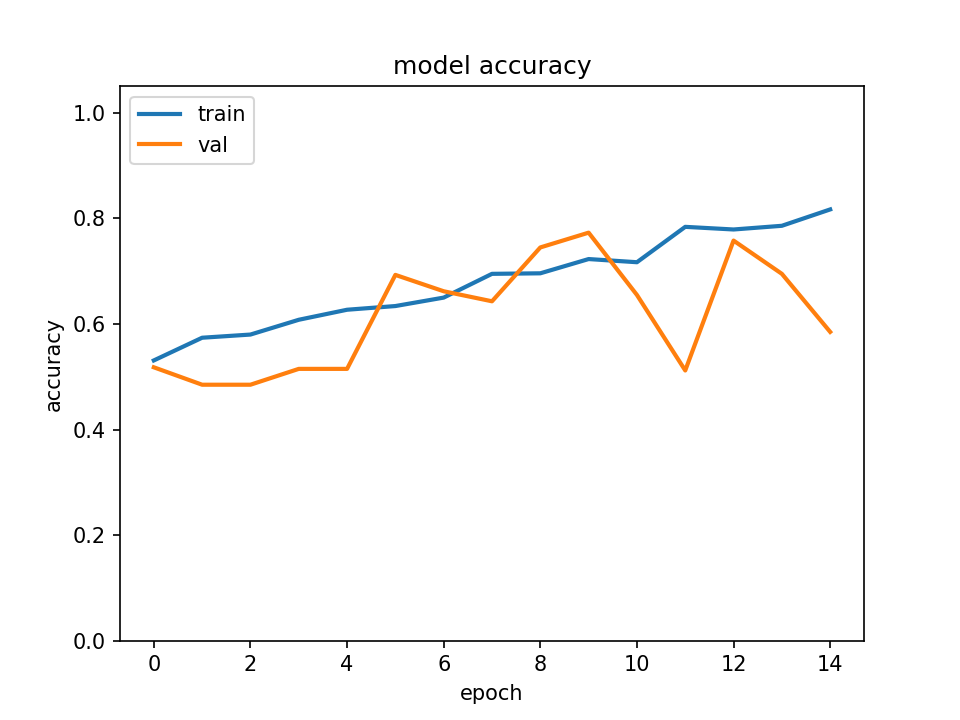

# pcam_analysis

## Introduction

This notebook presents an exploratory analysis of the PCAM dataset, using
off-the-shelf deep learning libraries (tensorflow & keras).

PatchCamelyon (PCAM) is a public dataset of 327.680 images (96 x 96 px)
extracted from histopathologic microscope scans of lymph nodes sections.

Each image is annotated with a binary label indicating the presence of
metastatic (i.e. tumoral) tissue in the center of image. A positive value
indicates that the center 32 x 32 px region of the image contains at least one
pixel of tumor tissue. Note that tumor tissue in the outer region does not
influence the value of the label. 

The original dataset is divided into a training set of 262.144 examples, a
validation set of 32768 examples and a test set of 32.768 examples.

For more details on the dataset, please see the original [PCAM
repository](https://github.com/basveeling/pcam) on github.

This dataset was released as part of a scientific work by PhD student Bas
Veelin [1]. For the original Camelyon16 dataset paper, see [2].

It is worth noting that this dataset is slightly different from the [Kaggle
PCAM dataset](https://www.kaggle.com/c/histopathologic-cancer-detection), and
that the results are not the same.

The PCAM dataset was downloaded according to the PCAM repository instructions
from the google drive and was packaged for conveniency as a single numpy "npz"
file containing the training, validation and test datasets.  

The deep learning models are coded in python with
[tensorflow](https://www.tensorflow.org/) version 1.18 and
[keras](https://keras.io/) version 2.2.4.

The training and testing was done on an AWS ubuntu deep learning image with an
NVIDIA K80 GPU card. 

## Results

Three different types of convolutional neural networks (CNNs, also named
ConvNets) were tested on the dataset. CNNs leverage the spatial information of
2D images and are therefore very well suited for classification tasks and their
architecture is inspired by the visual cortex. 

Here we try four different models for the PCAM dataset of increasing complexity:

1. Simple and shallow CNN model with few layers (6 layers).
1. Deep CNN model with multiple layers (28 layers).   
1. Transfer learning model based on Google Inception V3 with ImageNet weights (314 layers).
1. Full re-training of the Inception V3 on the PCAM dataset (314 layers).

For each model, we train for a few epochs, compute accuracy and loss on the
validation set and finally calculate accuracy, loss and ROC AUC on the test
set.

| | Simple Model | Deep model | Transfer learning | Full Inception |   

## Bibliography

**[1] B. S. Veeling, J. Linmans, J. Winkens, T. Cohen, M. Welling. "Rotation
Equivariant CNNs for Digital Pathology".
[arXiv:1806.03962](http://arxiv.org/abs/1806.03962)**

**[2] Ehteshami Bejnordi et al. Diagnostic Assessment of Deep Learning
Algorithms for Detection of Lymph Node Metastases in Women With Breast Cancer.
JAMA: The Journal of the American Medical Association, 318(22), 2199–2210.
[doi:jama.2017.14585](https://doi.org/10.1001/jama.2017.14585)**

<!--

test
-->

