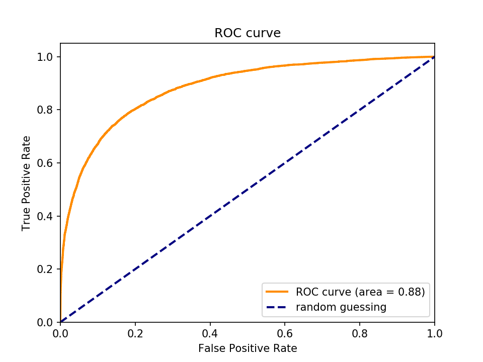
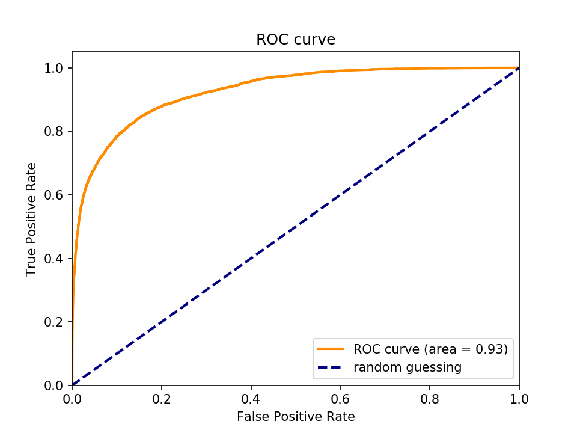
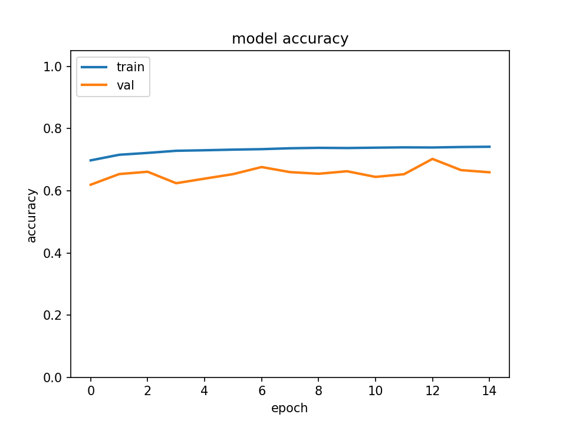
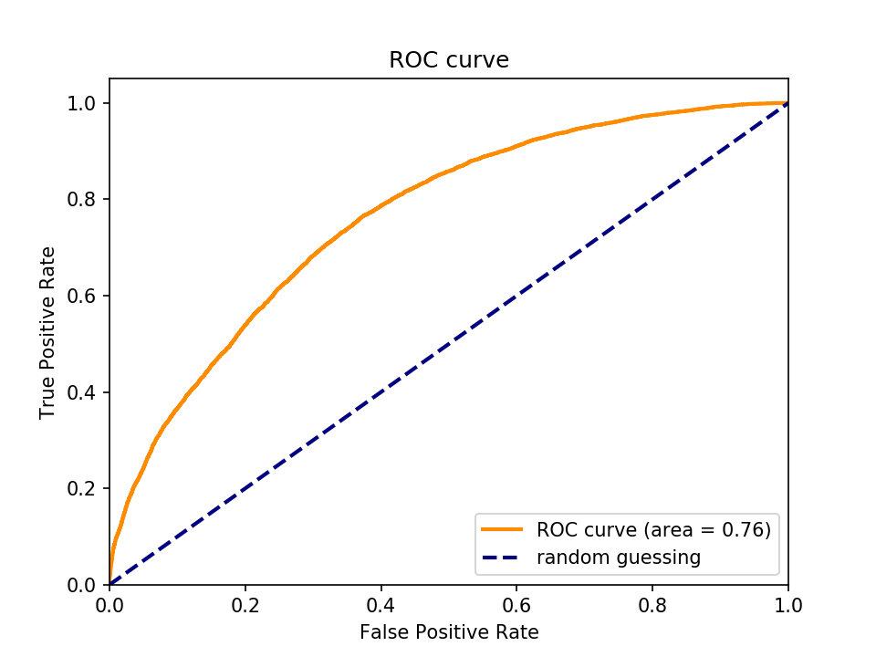
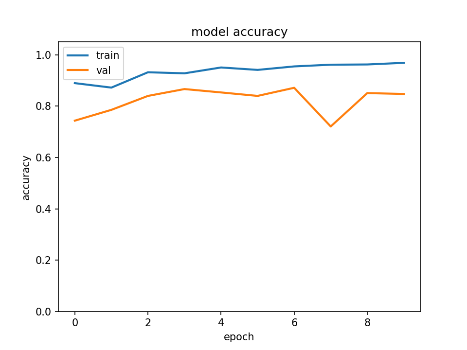

# pcam_analysis

## Introduction

This notebook presents an exploratory analysis of the PCAM dataset, using
off-the-shelf deep learning libraries (tensorflow & keras).

PatchCamelyon (PCAM) is a public dataset of 327.680 images (96 x 96 px)
extracted from histopathologic microscope scans of lymph nodes sections.

Each image is annotated with a binary label indicating the presence of
metastatic (i.e. tumoral) tissue in the center of image. A positive value
indicates that the center 32 x 32 px region of the image contains at least one
pixel of tumor tissue. Note that tumor tissue in the outer region does not
influence the value of the label. 

The original dataset is divided into a training set of 262.144 examples, a
validation set of 32768 examples and a test set of 32.768 examples.

For more details on the dataset, please see the original [PCAM
repository](https://github.com/basveeling/pcam) on github.

The complete dataset can be dowloaded from [Google
drive](https://drive.google.com/drive/folders/1gHou49cA1s5vua2V5L98Lt8TiWA3FrKB).

This dataset was released as part of a scientific work by PhD student Bas
Veelin [1]. For the original Camelyon16 dataset paper, see [2].

The PCAM dataset was downloaded according to the PCAM repository instructions
from the google drive and was packaged for conveniency as a single numpy "npz"
file containing the training, validation and test datasets.  

The deep learning models are coded in python with
[tensorflow](https://www.tensorflow.org/) version 1.18 and
[keras](https://keras.io/) version 2.2.4.

The training and testing was done on an AWS ubuntu (18.04) deep learning image with an
NVIDIA K80 GPU card. 

The code for tensorflow v2.1 (which now includes Keras) is in the tensorflow2.1 directory. 

## Results

Three different types of convolutional neural networks (CNNs, also named
ConvNets) were tested on the dataset. CNNs leverage the spatial information of
2D images and are therefore very well suited for classification tasks and their
architecture is inspired by the visual cortex. 

Here I try four different models for the PCAM dataset of increasing complexity:

1. Simple and shallow CNN model with few layers (6 layers).
1. Deep CNN model with multiple layers (28 layers).   
1. Transfer learning model based on Google Inception V3 with ImageNet weights (314 layers).
1. Full re-training of the Inception V3 on the PCAM dataset (314 layers).

The simple model is based after a [keras
example](https://keras.io/examples/mnist_cnn/) of a simple CNN model for the
MNIST dataset. The model is composed of  2 convolutional layers followed by a pooling layer,
a dropout layer, a dense layer and finally by the output layer:

In -> Conv -> Conv -> Pooling -> Dropout -> Dense -> Out

The deep model was inspired by a [kaggle
model](https://www.kaggle.com/fmarazzi/baseline-keras-cnn-roc-fast-10min-0-925-lb)
by Francesco Marazzi:

In -> [Conv x2 -> Pool -> Dropout] x3 -> Dense -> Dropout -> Out

For transfer learning, I load the InceptionV3 model trained on the full
ImageNet dataset from keras. The model is imported without the top layers, and
a global average pooling and a dense layers are added and trained on the data.

Finally, I also re-train the InceptionV3 model on the dataset, by setting all
the layers as trainable and re-running the complete dataset on the model.

For each model, I train for a few epochs, compute accuracy and loss on the
validation set and finally calculate accuracy, loss and ROC AUC on the test
set.

|                 | Simple CNN   | Deep CNN   | Transfer learning | Full Inception |   
|-----------------|--------------|------------|-------------------|----------------|
| Nb epochs       | 15           | 15         | 15                | 10             |
| Batch size      | 32           | 32         | 32                | 64             |
| Dense layer     | 256          | 256        | 256               | 256            |
| Tot. nb param.  | 9.5 M        | 2.4 M      | 22.3 M            | 22.3 M         |
| Training param. | 9.5 M        | 2.4 M      | 524 K             | 22.2 M         |
| Timing 1 epoch  | 325 s        | 562 s      | 468 s             | 1333 s         |
| Nb layers       | 10           | 28         | 314               | 314            |
| Max valid. acc. | 0.82         | 0.88       | 0.70              | 0.87           |
| Test loss       | 0.52         | 0.39       | 0.73              | 0.47           |
| Test acc.       | 0.79         | 0.83       | 0.68              | 0.84           | 
| AUC             | 0.88         | 0.93       | 0.76              | 0.93           |

By looking at the performance indicators on the test set (loss, accuracy and
AUC-ROC), we can see that the simple model performs quite well (0.88 AUC), but
that a deeper model performs even better (0.93 AUC). Transfer learning with the
InceptionV3 model does not work well, with an AUC thathas the lowest value for
the four models tested here (0.76). Re-training the InceptionV3 model brings
improved results that are comparable to the deep model (identical AUC, loss
higher and accuracy quite equal). The reason why transfer learning does not
work in this case could be that the features learned by the model on the
ImageNet dataset are not relevant for the PCAM dataset.

<figure>

<figcaption><b>Figure 1.</b> Validation accuracy and ROC curve for the simple model.</figcaption>
</figure>

<figure>

<figcaption><b>Figure 2.</b> Validation accuracy and ROC curve for the deep model.</figcaption>
</figure>

<figure>

<figcaption><b>Figure 3.</b> Validation accuracy and ROC curve for the transfer learning (ImageNet InceptionV3)  model.</figcaption>
</figure>

<figure>

<figcaption><b>Figure 4.</b> Validation accuracy and ROC curve for the InceptionV3 model retrained on the pcam data.</figcaption>
</figure>

## Bibliography

**[1] B. S. Veeling, J. Linmans, J. Winkens, T. Cohen, M. Welling. "Rotation
Equivariant CNNs for Digital Pathology".
[arXiv:1806.03962](http://arxiv.org/abs/1806.03962)**

**[2] Ehteshami Bejnordi et al. Diagnostic Assessment of Deep Learning
Algorithms for Detection of Lymph Node Metastases in Women With Breast Cancer.
JAMA: The Journal of the American Medical Association, 318(22), 2199–2210.
[doi:jama.2017.14585](https://doi.org/10.1001/jama.2017.14585)**

